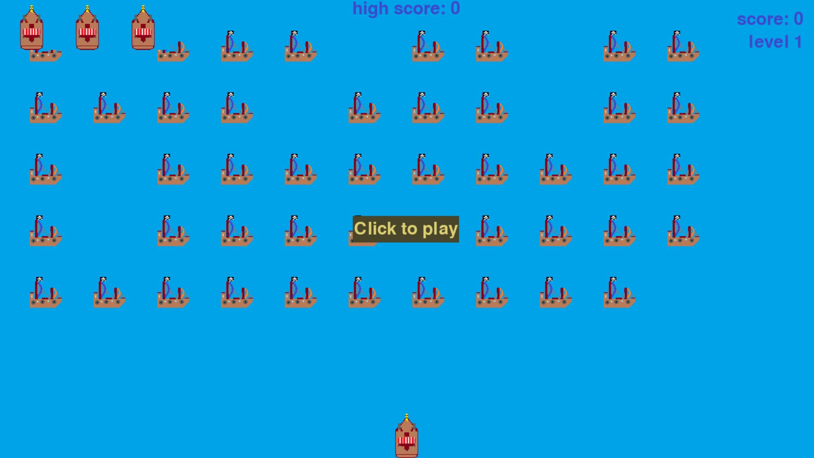

# Pirates Invasion

by Janek SQ9NIL, www.operator-paramedyk.pl

## Introduction

<i> Pirates Invasion</i> is a simple <i>Space Invaders</i> clone based on tutorial in Eric Matthes _Python Crash Course: A Hands-On, Project-Based Introduction to Programming_ (2nd Edition by No Starch Press, Inc.). I followed his instructions when I started to learn Python and then made some changes:

- changed topic from alien invasion to sea battle with pirates (my son loves them!) by adding graphics by myself,
- added random distribution of pirates in the fleet,
- improve graphics by flipping ships when they reach the boarder of the screen.

## Gameplay

You are the captain of a ship fighting the pirates fleet that wants to enter the port. Your task is to shoot all pirates ships before they cross your position.

To start the game, press __Click to play__ button.

Use __left and right arrows keys__ to move your ship left and right, and press __spacebar__ to shoot the cannon. You can shoot three cannonballs at the same time.

You can quit the game by pressing __q__ at any time.

Every time you shoot all the pirates ships, you progress to next level.  This means that new pirates fleet, that is faster than the previous one, is generated, and you will get more points for every pirates ship shoot down.

if pirates ship collides with yours or reaches the bottom of the screen, you will loose one ship. Game ends if you loose three ships (by default).

## Game settings

You can control the game with Settings class, stored in settings.py file. Below all of them are clarified, together with the default values.

### Static settings

These are the settings that are set-up once for the whole game.

#### Screen settings

- screen resolution: <code>self.screen_width = 1200</code> and <code>self.screen_height = 720</code>

- background color (seawater) <code>self.bg_color = (0, 162, 232)</code>

#### Ship settings

- number of lives (presented in the top-left corner of the screen): <code>self.ships_limit = 3</code>

#### Bullet settings

- cannonball dimensions: <code>self.bullet_width = 10</code> and <code>self.bullet_height = 10</code>

- cannonball color: <code>self.bullet_color = (105, 105, 105)</code>

- number of cannonballs that can be shoot at the same time (it wasn't so easy to load the cannon): <code>self.bullets_allowed = 3</code>

#### Pirate settings

- pirates fleet vertical speed: <code>self.fleet_drop_speed = 20</code>

- probability (set as a value between 1 and 10) that position in pirates fleet is filled with a ship during fleet creation: <code>self.pirate_probability = 8</code>

#### Level increase settings

- factor to increase fleet horizontal speed when the level changes: <code>self.speedup_scale = 1.1</code>

- factor to increase the score per pirates ship shoot down with the level change: <code>self.speedup_score = 1.5</code>

#### Speed

- horizontal speed of player's ship: `self.ship_speed = 2`

- vertical speed of player's bullets (negative as they are moving upwards): `self.bullet_speed = 2`

### Dynamic settings

These settings will change during the gameplay.

#### Speed

- horizontal speed of pirates ships: <code>self.pirate_speed = 0.75</code>

##### Fleet direction: 1 - right, -1 - left

- fleet's direction (changes when fleet reaches screen's boarder): <code>self.fleet_direction = 1</code>

#### Points for shooting a pirate

- initial points value for a pirate ship shoot down:  <code>self.pirate_points = 20</code>

## TO DOs

I want to make two improvements in this project:

- add option to start the game with pressing the space bar,

- present all-the-time top score at the top of the screen.
